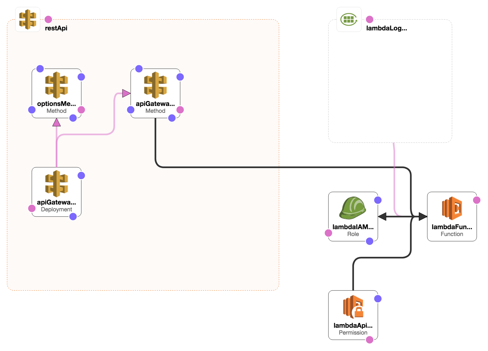

_Functional demo can be found here: [GitHub — quinn/lambda-nodejs-example](https://github.com/quinn/lambda-nodejs-example)_

Here’s a process for creating simple backends for a web client app. Use cases would be when you would like to add a small piece of functionality that doesn’t have much interaction with the rest of the app, but don’t want the overhead that comes with standing up a server.

## API Gateway Models

A lot of articles on this topic using [AWS API Gateway Models](https://docs.aws.amazon.com/AWSCloudFormation/latest/UserGuide/aws-resource-apigateway-model.html). This is probably helpful if you are building a full-sized REST API around well defined resources, which wasn’t really my use case (small, independent/unrelated behavior). I’m interested in learning more about this but (for now) I’ll probably continue using ruby / node / python app server on VPS (e.g. EC2) for this type of thing.

## CloudFormation

Since using Lambda was new to me I wanted to make sure I could easily replicate the process so I decided to use CloudFormation to preserve the configuration and make it easy to replicate. It sucks figuring out something in the AWS console and then not really remembering the exact steps to recreate it. CloudFormation isn’t the only way to get this working, but it helped me a lot while learning the ins-and-outs of Lambda + API Gateway.

## Application Structure


<small><center>
_Diagram of CloudFormation Template generated by [Designer](https://docs.aws.amazon.com/AWSCloudFormation/latest/UserGuide/working-with-templates-cfn-designer.html)_
</center></small>

This configuration creates the simplest possible setup that I could figure out for a web client. There are two routes:
 * `POST /`: This is connected to the lambda function. API Gateway passes information about
   the request as arguments to the lambda function. The function returns an object which
   contains information on how the http response should be structured, e.g:

   ```
   {
       body: "Content for the HTTP Body",
       statusCode: 200, // or any other status code
       headers: {
           "Content-Type": "text/plain",
           // etc, more headers
       },
   }
   ```

 * `OPTIONS /`: The second route is on the same path but receives on an OPTIONS request. It
   simply responds with the most permissive CORS possible. In a larger app, you could
   configure your own CORS API handler to do something more sophisticated, e.g. returning the
   appropriate headers to enforce a whitelist of allowed domains.

Here is the resource definition that attaches API Gateway to Lambda:

```yaml
"apiGatewayRootMethod":
  Type: AWS::ApiGateway::Method
  Properties:
    AuthorizationType: NONE
    HttpMethod: POST
    ResourceId: !GetAtt "restApi.RootResourceId"
    RestApiId: !Ref "restApi"
    Integration:
      IntegrationHttpMethod: "POST"
      Type: "AWS_PROXY"
      Uri: !Sub
        - "arn:aws:apigateway:${AWS::Region}:lambda:path/2015-03-31/functions/${lambdaArn}/invocations"
        - lambdaArn: !GetAtt "lambdaFunction.Arn"
```

In the above resource it is referencing a Lambda function resource named lambdaFunction. See the last line where this reference is created. And the other major piece, the resource definition for the Lambda function:

```yaml
"lambdaFunction":
  Type: "AWS::Lambda::Function"
  Properties:
    Code:
      S3Bucket: !Ref bucketName
      S3Key: !Ref bucketKey
    FunctionName: !Ref "lambdaFunctionName"
    Handler: index.handler
    MemorySize: 128
    Role: !GetAtt "lambdaIAMRole.Arn"
    Runtime: nodejs8.10
    Timeout: 10
```

This simply takes as parameters the bucket name and bucket key and loads the zip file located there. Nodejs package managers load all dependencies relative to the project (in `node_modules`) it is very straightforward to create a standalone bundle. See the repo for an example of how to do this.

## Caveats

The main caveat that I found was that CloudFormation only _updates configuration_. So, certain things may require manual intervention after the stack has been deployed. Updates to the lambda function code seem to be available immediately. However, API Gateway has it’s own “deploy” process which must be ran for any changes to the API Gateway. Typically, changes will probably be with the function code rather than the API structure, so this doesn’t seem like a huge inconvenience. Ideally I’d like to figure out a way to automate this as well.

---

This is a “beginner” post, so let me know if what you think and if I missed anything!
