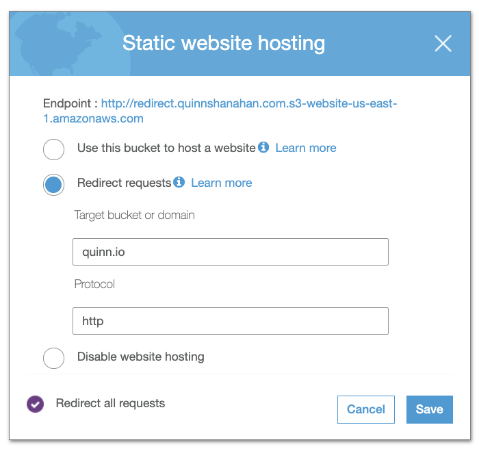
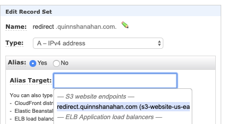
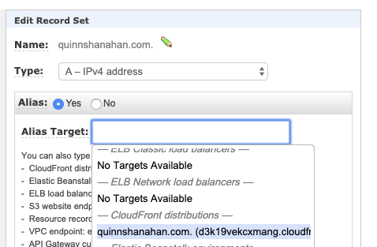

All I wanted to do was redirect quinnshanahan.com to quinn.io. Simple, right? Simple enough to not require a server, _right_?

As simple as this would be using a droplet or an existing host I have running with nginx, or even a lambda function I really wanted to do this without any host of any kind. I thought this should be possible on AWS, and it was, but very convoluted.

The main thing that makes this work is a feature for S3 that allows you to redirect a bucket to any other domain. The config looks like this in the console:

Thats pretty straightforward. Now all you have to do is create a bucket with a name matching the hostname that you want to redirect from and you are good to go. You may notice here the bucket name is `redirect.quinnshanahan.com`. The reason for this is that it is not possible to attach an SSL certificate to a bucket, and instead you must create an SSL certificate and attach it to a Cloudfront distribution. The latter half of [This blog post](https://medium.com/@channaly/how-to-host-static-website-with-https-using-amazon-s3-251434490c59) describes the process well. The main difference is that instead of associating the distribution with the S3 bucket I associated it with the domain `redirect.quinnshanahan.com`. This allows cloudfront to receive the `301` from the static website hosting rather than the `403` from the bucket.

The final step is to tie everything together in Route 53 using aliases.

I did the same thing for `www`.

Adding SSL to the redirect domain probably made things overly complicated, and arguably not necessary. Since my browser has cached that I had SSL on `quinnshanahan.com` it was probably mostly for myself than anyone else.

---

References: 
[How to host static website with https using amazon s3](https://medium.com/@channaly/how-to-host-static-website-with-https-using-amazon-s3-251434490c59) 
[Redirect a Domain to Another Domain using Route 53](https://aws.amazon.com/premiumsupport/knowledge-center/redirect-domain-route-53/)
