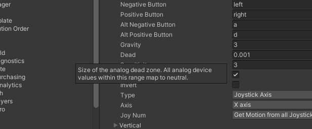

## How did we end up here

I've decided to add Unity to my long list of unfinished "learn a new thing" projects. This decision was inspired by a few different things. The first is nastalgia for Adobe, _cough_, __Macromedia__ (RIP) Flash, one of the first tools I used to learn programming. It also drove a lot of creative and interactive content in the early days of the web, some of it amazing, and some of it (most of it?) terrible. It did create the opportunity for very open-ended interactive experiences in the browser, something that hasn't been fully replicated to this day, in my opinion. Unity seems like a good fit to recreate some of this experience, given that it is a visual editor tool, with programming as an extension: C#, compared to Flash's proprietary actionscript.

The second is trying to find a consistent programming hobby for myself. I code for work of course, but programming first and foremost for me is a hobby. I've tried in the past to work on side projects for hobby programming, but the problem with building products is that I usually end up with too many practical considerations and losing motivation in that way. Game development seems like an open-ended project where I don't have to worry about the practical implications of what I'm building.

## Setting up a joystick

In the first tutorial for a 2d platformer I decided to see if I could get my joystick (X-Box controller) to work instead of using the keyboard. I don't use the default keyboard layout so WASD doesn't really work for me. This can be changed in this settings panel:

It seemed to work right away after this, but I immediately noticed the character in the tutorial project "drifting" slightly to the right when I wasn't touching the joystick.

Since this is a still screenshot its hard to tell, but you can see in the X transform on the right. This is without touching the controller. Some quick googling reveals this can be fixed by adjusting the "dead value":

I bumped the value all the way up to `0.5` before all of the drift was removed. This made me wonder, do all games program in a high dead value like this? I assume they must, since my controller works fine for all games I've played with it. Or, there is some other adjustment happening with the OS, or some other variable I'm not aware of, which all seems unlikely. It's an interesting problem I wouldn't have expected to encounter.

That's all for now, more exciting tails of game dev coming soon hopefully.
